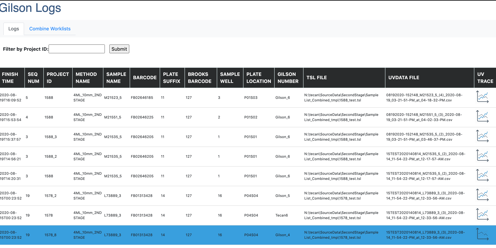

# Gilson Worklist Combiner

A flask web-app that logs chromatography runs as they finish on the Gilson GX-281 liquid handler. The web-app serves as a central information hub for end-users to easily analyse and interpret without having to dig for disparate information. There is an option to automatically generate a `.tsl` worklist file to import into Trilution software in order to run multiple samples on the GX-180 liquid handler. Contains test code (as Jupyter notebooks `ipynb`) and raw data. The back-end includes `ElasticSearch`, `MongoDB`, `Redis`, `RQ` and `Oracle`. Redis and RQ are combined to act as a task queue processor, ElasticSearch is used for querying and saving all the metadata and chromatography data, MongoDB is used for current run logging and Oracle serves as a backup for ElasticSearch since the project is trying out ElasticSearch's capabilities.

## Usage

Enter the command: `docker-compose build` in the app directory and subsequently, `docker-compose up`. The (client-side) gilson local computer will send a post request to the server-side which will collect all the metadata on the current run and upload to the ElasticSearch database. There is a script that will be executed on the client-side that will be run on the Trilution software. A sleep timer that will trigger after which the server-side would search for the raw chromatography export file on the shared network drive. This file is then uploaded to ElasticSearch and the end-user is able to view the chromatography trace without having to rely on the proprietary software, and more importantly without having to wait until the entire run is finished.

## Screenshot

